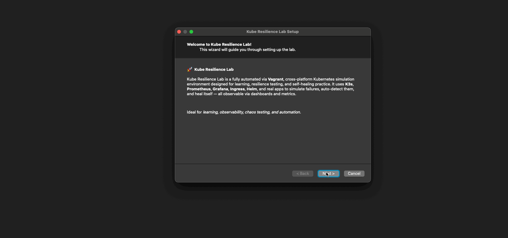
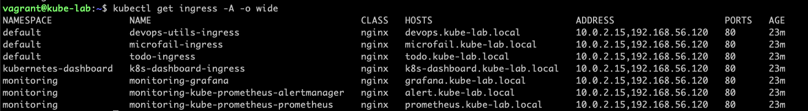
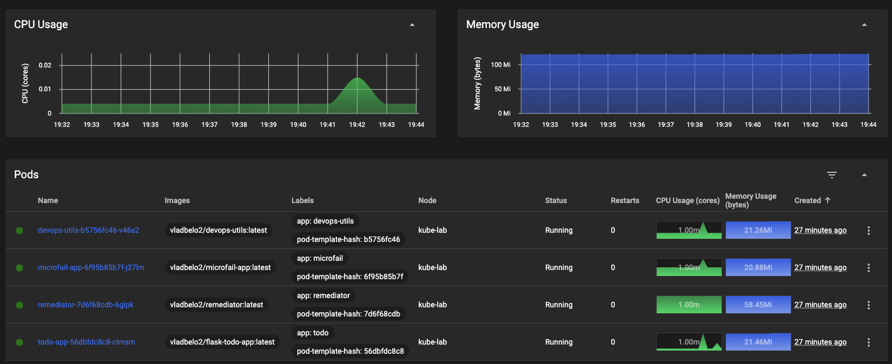
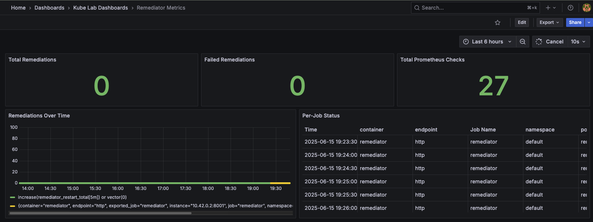
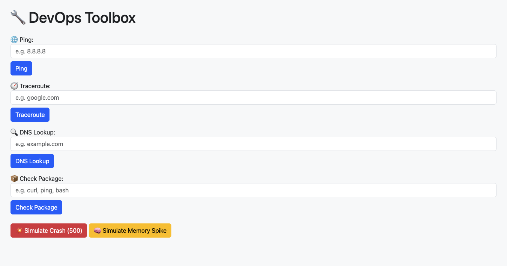
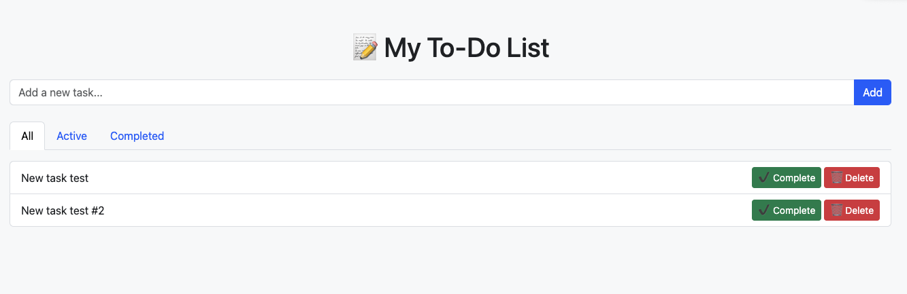

# 🚀 Kube Resilience Lab

[](https://github.com/vladbelo2/kube-resilience-lab/actions)
[](LICENSE)

## Descriptions

A fully automated, cross-platform Kubernetes resilience lab using **K3s**, provisioned via **Vagrant**, with **Helm**, **Prometheus**, **Grafana**, **NGINX Ingress**, and real-world microservices.  
Simulate failures, auto-detect and remediate them, and monitor the entire system with beautiful dashboards — all via a **single cross-platform installer**.

> Provision everything via a single cross-platform GUI wizard — no manual steps required.

---

## 📖 Use Case

This project is ideal for:

- Practicing Kubernetes troubleshooting

- Learning Prometheus and Grafana

- Simulating SRE incidents and remediation

- Testing Ingress, dashboards, and Helm charts

---

## 🌟 Features

| Feature                        | Description                                                                 |
|--------------------------------|-----------------------------------------------------------------------------|
| ✅ GUI Installer               | PyQt5 GUI wizard for full automation (IP, Vagrant, provisioning)            |
| ⚙️ K3s Cluster                 | Lightweight K8s using [K3s](https://k3s.io)                                 |
| 🧠 Pod Health Checks           | Real-time post-provisioning readiness validation                            |
| 📊 Prometheus + Grafana        | Deployed with Helm, preloaded dashboards, full metrics view                 |
| 🛠️ DevOps Toolbox              | Web UI for ping, traceroute, DNS, and package checks                        |
| 🛠️ Auto Remediator             | Python app restarts failed pods based on Prometheus metrics                 |
| 💣 Failure Simulator           | CronJob deletes a random pod every 2 minutes                                |
| 🌐 Ingress Routing             | Custom `.kube-lab.local` domains with clean access                          |
| 📆 Post-Provision Checks       | Health validation for pods, endpoints, Prometheus targets                   |
| 📃 Full Dashboards             | Grafana dashboards auto-provisioned for each app

---

## 🖼️ Architecture Overview

```text
PyQt5 GUI Wizard
     ⬇
  Vagrant + Ubuntu VM
     ⬇
     K3s Cluster
     ⬇
Helm Installs:
  • kube-prometheus-stack
  • ingress-nginx
     ⬇
Apps:
  • microfail
  • todo
  • remediator
  • devops-utils
     ⬇
Prometheus scrapes all
Grafana loads dashboards

```

---

## 📋 Requirements

- [Vagrant](https://www.vagrantup.com/) (>= 2.2)
- [VirtualBox](https://www.virtualbox.org/) (>= 7.0)
- [Python 3.8+](https://www.python.org/downloads/)
- OS support:
  - ✅ macOS
  - ✅ Linux (Ubuntu/Debian/Fedora)
  - ✅ Windows 10+ (PyQt5 GUI supported)
- PyQt5 ⭕️ Auto	Automatically installed if missing

---

## 🚀 Quickstart

### 1. Clone the Repo


```bash
git clone https://github.com/vladbelo2/kube-resilience-lab.git
cd kube-resilience-lab
```

### 2. Launch the Wizard

```bash
python3 launch.py
```

- Prompts for VM IP address (e.g. 192.168.56.120)

- Automatically edits Vagrantfile + env.conf

- Launches full provisioning (vagrant up)

- Displays real-time status and health checks

- Full provisioning with live status updates


## 🧪 Chaos Simulator

A Kubernetes CronJob randomly deletes a pod every 2 minutes.

To disable:
``` bash
kubectl patch cronjob failure-simulator -p '{"spec": {"suspend": true}}'
```

Or set this in env.conf:
``` bash
ENABLE_CHAOS_SIMULATOR=false

```

---

## 🧠 Smart Health Checks

During provisioning, the wizard:

- Verifies Ingress reachability for all apps

- Validates Prometheus target JSON responses

- Waits up to 3 minutes for all pods to be Running

- Displays status live in the GUI wizard output

---

## 🌐 Access the Lab

| Service           | URL                                      |
| ----------------- | ---------------------------------------- |
| 🧪 K8s Dashboard  | https://k8s-dashboard.kube-lab.local     |
| 🔍 Prometheus     | http://prometheus.kube-lab.local         |
| 📊 Grafana        | http://grafana.kube-lab.local            |
| 📝 To-Do App      | http://todo.kube-lab.local               |
| 🛠 DevOps Tools   | http://devops.kube-lab.local             |
| 💥 MicroFail App  | http://microfail.kube-lab.local          |

---

## 🔐 Dashboard Access Token

After setup, use the wizard's "📂 View Token" or run manually:

```bash
kubectl -n kubernetes-dashboard get secret static-admin-user-token -o jsonpath="{.data.token}" | base64 --decode
```

---

## 📊 Grafana Dashboards

Preloaded in Grafana under "Kube Lab Dashboards" folder:

| Dashboard	         | Panels Included   |
| ------------------ | ----------------- |
| 📈 MicroFail App   | Crash count, CPU usage, memory, restarts |
| 📝 To-Do App	     | Task count (active, total, deleted) |
| 🧪 Remediator	     | Prometheus checks, restarts, failures, per-job stats |
| 🧠 K8s Node Health | Default via kube-prometheus-stack |

Dashboards live under: “Kube Lab Dashboards” folder in Grafana.

---

## 🧠 Smart Health Checks

During provisioning, the wizard:

- Waits for all pods to become Running

- Re-checks every 10s, up to 3 minutes

- Shows ✅/⚠️ status for each pod

---

## 📁 Folder Structure

```text
kube-resilience-lab/
├── grafana/
│   ├── dashboards/
│   └── provisioning/
├── kubernetes/
│   ├── helm/
│   ├── ingress/
│   ├── manifests/
│   ├── monitoring/
│   └── k8s-dashboard/
├── python/
│   └── apps/
│       ├── microfail-app/
│       ├── todo-app/
│       ├── remediator/
│       └── devops-utils/
├── screenshots/
├── env.conf
├── launch.py
├── Vagrantfile
├── provision.sh
└── README.md
```

---

## 📸 Screenshots

| Wizard Setup | Ingress Routing | K8s Dashboard |
|--------------|-----------------|----------------|
|  |  |  |

| Grafana Dashboard | DevOps Toolbox | To-Do App |
|-------------------|----------------|-----------|
|  |  |  |

---

## 🧭 Roadmap

| Phase	       | Goal            | 
| ------------ | ----------------|
| ✅ Phase 1	  | Auto-provision Grafana dashboards via Helm values + ConfigMap
| ✅ Phase 2   | Add GitHub Actions to validate provisioning + test service health
| 💣 Phase 3   | Add more chaos: CPU spike, disk fill, kill Ingress, DNS failures
| 🧠 Phase 4   | Integrate Ansible for OS-level remediation (e.g. clear disk)
| 🌍 Phase 5   | Publish as GitHub template + full documentation + screenshots

---

## 📄 License

MIT License

---

## 👨‍💻 Author

Built by **Vlad Belo** with with passion, Python, and Prometheus ✨ and 🤖 AI-powered wizardry.

---

> Found it useful? ⭐ Star this repo to support the project and help more DevOps learners discover it.
