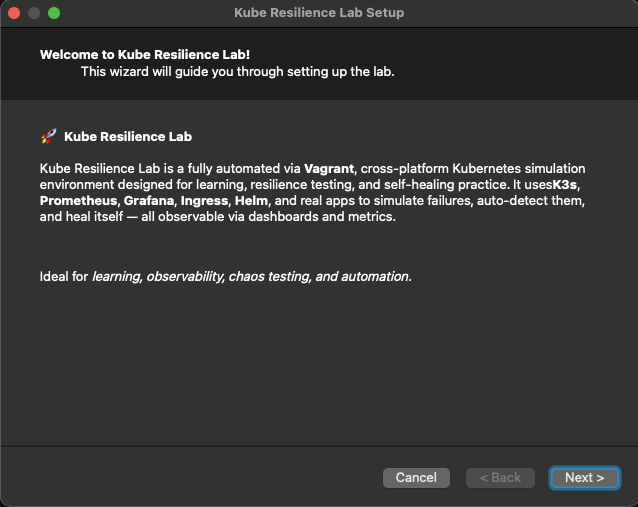

# 🚀 Kube Resilience Lab

## Descriptions

A fully-automated Kubernetes resilience playground using **K3s**, **Helm**, **Prometheus**, **Grafana**, **NGINX Ingress**, and real Flask-based apps — provisioned via **Vagrant** and managed with a **cross-platform GUI wizard**.


Designed for:
- **Site Reliability Engineers (SRE)**
- **DevOps engineers**
- **Kubernetes learners**

to simulate, observe, and automatically remediate production-like failures — all observable through clean dashboards and metrics.

---

## 🧠 What It Does

Kube Resilience Lab lets you:

| Capability                         | Description                                                                 |
|------------------------------------|-----------------------------------------------------------------------------|
| ✅ **Simulate Failures**           | Random pod kills, CPU load, disk fill, HTTP 500s, and more via cronjob.     |
| ✅ **Observe Everything**          | Prometheus + Grafana with auto-provisioned dashboards and custom metrics.   |
| ✅ **Auto-Remediate**              | A Python-based controller restarts broken deployments based on metrics.     |
| ✅ **One-Click Provisioning**      | Wizard-style `launch.py` sets everything up — from VM to dashboards.        |
| ✅ **Ingress with Custom Domains** | Use local DNS mapping for clean `.kube-lab.local` access.                   |
| ✅ **Real Flask Apps**             | Includes To-Do app, DevOps Toolbox app, and crashable MicroFail app.        |
| ✅ **Hands-On DevOps Tools**       | Toolbox app with ping, traceroute, dig, package checks, and crash triggers. |

---

## 📦 Apps & Components

| Name                | Type          | Description |
|---------------------|---------------|-------------|
| 🐍 **MicroFail**    | Flask App     | Simulates crashes, CPU burn, disk fill, emits Prometheus metrics. |
| ✅ **Remediator**   | Python Daemon | Auto-heals pods when `up == 0`, using Prometheus metrics. |
| ✅ **To-Do App**    | Flask App     | Full CRUD + Prometheus metrics (total, active, completed tasks). |
| 🛠 **DevOps Utils** | Flask App     | UI to run `ping`, `traceroute`, `dig`, and check installed packages. |

---

## 📋 Requirements

- [Vagrant](https://www.vagrantup.com/) (>= 2.2)
- [VirtualBox](https://www.virtualbox.org/) (>= 7.0)
- [Python 3.8+](https://www.python.org/downloads/)
- OS support:
  - ✅ macOS
  - ✅ Linux (Ubuntu/Debian/Fedora)
  - ✅ Windows 10+ (PyQt5 GUI supported)

---

## 🚀 Quickstart

### 1. Clone the Repo


```bash
git clone https://github.com/vladbelo2/kube-resilience-lab.git
cd kube-resilience-lab
```

### 2. Launch the Wizard

```bash
python3 launch.py
```

- Prompts for VM IP address (e.g. 192.168.56.120)

- Automatically edits Vagrantfile + env.conf

- Launches full provisioning (vagrant up)

- Displays real-time status and health checks

### 3. Add Local DNS Mappings
Edit your /etc/hosts (Linux/macOS) or C:\Windows\System32\drivers\etc\hosts:

The IP you input from the Wizard 
```markdown
192.168.56.120  k8s-dashboard.kube-lab.local prometheus.kube-lab.local grafana.kube-lab.local microfail.kube-lab.local todo.kube-lab.local

```

## 🧪 Chaos Simulator

A Kubernetes CronJob randomly deletes a pod every 2 minutes.

To disable:
``` bash
kubectl patch cronjob failure-simulator -p '{"spec": {"suspend": true}}'
```

Or set this in env.conf:
``` bash
ENABLE_CHAOS_SIMULATOR=false

```

---

## 🧠 Pod Health Verification
During provisioning, the wizard:

- Waits up to 3 minutes for all pods to be Running

- Re-checks every 10s

- Displays ✅/⚠️ icons with status

- Helps detect stuck or failed containers right away

---

## 🌐 Access the Lab


| Service           | URL                                      |
| ----------------- | ---------------------------------------- |
| 🧪 K8s Dashboard  | https://k8s-dashboard.kube-lab.local     |
| 🔍 Prometheus     | http://prometheus.kube-lab.local         |
| 📊 Grafana        | http://grafana.kube-lab.local            |
| 💥 MicroFail App  | http://microfail.kube-lab.local          |
| 📝 To-Do App      | http://todo.kube-lab.local               |
| 🛠 DevOps Tools   | http://todo.kube-lab.local               |

---

## 🔐 Dashboard Access Token

After setup, use the wizard's "📂 View Token" or run manually:

```bash
kubectl -n kubernetes-dashboard get secret static-admin-user-token -o jsonpath="{.data.token}" | base64 --decode
```

---

## 📊 Grafana Dashboards

Auto-provisioned dashboards show:

- 📈 MicroFail: crashes, CPU/mem usage, pod restarts

- 🧪 Remediator: total checks, restarts, failure rates

- 📝 To-Do App: tasks created, completed, deleted

- 🧠 Node/Pod Health (via kube-prometheus-stack)

Dashboards live under: “Kube Lab Dashboards” folder in Grafana.

---

## 🧠 Smart Health Checks

During provisioning, the wizard:

- Waits for all pods to become Running

- Re-checks every 10s, up to 3 minutes

- Shows ✅/⚠️ status for each pod

---

## 📁 Folder Structure
```text
kube-resilience-lab/
├── grafana/              # Dashboards & provisioning
├── kubernetes/           # Manifests, Ingress, Helm values
├── monitoring/           # ServiceMonitors, ConfigMaps
├── python/apps/          # Flask apps (todo, microfail, remediator, utils)
├── launch.py             # Cross-platform GUI installer
├── provision.sh          # Vagrant provisioning script
├── Vagrantfile           # VM spec
├── env.conf              # Toggle installs/features
├── screenshots/          # UI screenshots
└── README.md
```

---

## 🧩 Project Architecture

```text
PyQt5 GUI
   ↓
Vagrant + Ubuntu
   ↓
K3s Kubernetes
   ↓
Helm installs:
   - kube-prometheus-stack
   - ingress-nginx
   ↓
K8s Deployments:
   - microfail, todo, remediator, utils
   ↓
Prometheus scrapes all apps via ServiceMonitors
Grafana auto-loads dashboards via ConfigMap

```

---

## 📸 Screenshots

> Add these to a `screenshots/` folder and update URLs once uploaded to GitHub.

| Wizard Setup | DevOps Toolbox App | Todo-App |
| ------------ | ---------------- | ---------------- |
|   |  |  |

---

## 🧭 Roadmap

| Phase	       | Goal            | 
| ------------ | ----------------|
| ✅ Phase 1	  | Auto-provision Grafana dashboards via Helm values + ConfigMap
| 🔄 Phase 2   | Add GitHub Actions to validate provisioning + test service health
| 💣 Phase 3   | Add more chaos: CPU spike, disk fill, kill Ingress, DNS failures
| 🧠 Phase 4   | Integrate Ansible for OS-level remediation (e.g. clear disk)
| 🌍 Phase 5   | Publish as GitHub template + full documentation + screenshots

---

## 👨‍💻 Author

Built by **Vlad Belo** with ❤️ and 🤖 AI-powered wizardry.

---

> Found it useful? ⭐ Star this repo to support the project and help more DevOps learners discover it.
